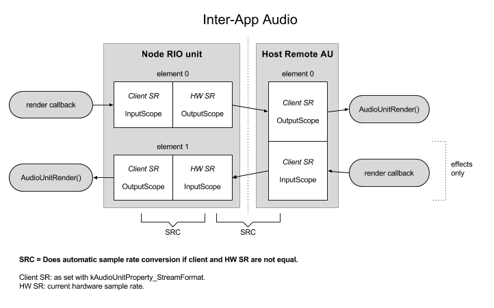

## Scopes and elements

The RemoteIO unit of the node has a client side (for the node) and the “outer" side (host, or hardware if not connected to host).

| Element | Input Scope           | Output Scope        |
| ------- | --------------------- | ------------------- |
| 0       | your render callback | speaker or host     |
| 1       | microphone or host    | AudioUnitRender()   |


You provide audio to the host or hardware output through your render callback, and you pull audio from the host or hardware input by calling AudioUnitRender() on element 1.

In this document, the RemoteIO unit is called RIO and the Remote AudioUnit (the IAA node unit from the host perspective) is called RAU.



## Host sample rate

​A host must init its RAUs using the hardware sample rate in its client format, which is set on the client side of the IAA node unit (input/output scope element 0), which equals the outer side (host or hardware) of the RIO unit from the node’s perspective.

When the hardware sample rate changes, the host should update the client side format of hosted RAUs, or else iOS will automatically insert sample rate converters - leading to unexpected buffer sizes and loss of audio quality.

The node can detect this and follow the host sample rate, or it could ignore it (as most IAA node apps does, currently). When ignored, the RIO will do sample rate conversion.

IAA host gives current time in samples. Since node and host might run at different sample rates, we must use the host SR for converting to seconds.

```objc
static void UpdateHostSampleRate(AudioUnit unit) {
    AudioStreamBasicDescription asbd = {0,};
    UInt32 dataSize = sizeof(asbd);
    AudioUnitGetProperty(unit,
        kAudioUnitProperty_StreamFormat,
        kAudioUnitScope_Output, 0, &asbd, &dataSize);
    hostSampleRate = asbd.mSampleRate;
}
```

## Detect SR changes

The host might change SR after connection. When an IAA host changes sample rate, it must uninitialize all the hosted nodes, change their stream format to use the new SR, and then initialize it again. The IAA node sees this as a disconnect-reconnect, at least most of the times.

NOTE: Using the `AVAudioSessionRouteChangeNotification` to update the sample rate *does not* work reliable. It works when plugging headphones and audio interfaces in/out, but most often not when the host changes sample rate. The technique used here catches all situations, also when plugging hardware.

Also note that the hardware sample rate might change even if you're not currently being hosted, or even if your app is not an IAA node app. This happens when another app using PlayAndRecord category was started before your app, and then the other app changes the preferredSampleRate on the audio session. So don't use the route-change notification!

The correct way is to use a property listener on `kAudioUnitProperty_StreamFormat`:

```objc
static void StreamFormatCallback(void *inRefCon,
    AudioUnit inUnit, AudioUnitPropertyID inID,
    AudioUnitScope inScope, AudioUnitElement inElement)
{
    // Output scope element 0 is the "outer" side for output
    if(inScope == kAudioUnitScope_Output && inElement == 0) {
        UpdateHostSampleRate(inUnit);
    }
}
```

And add the property listener when setting up IAA for our main audio unit:

```objc
AudioUnitAddPropertyListener(unit, 
    kAudioUnitProperty_StreamFormat,
    StreamFormatCallback, (__bridge void * _Nullable)(self));
```

You would also call `UpdateHostSampleRate(inUnit)` when connected, a good time is when getting the other data such as HostCallbackInfo and host icon.

## Flexible sample rate

Running the node in a different SR than the host is sub-optimal, since it introduces sample rate conversion and odd buffer sizes that changes for each render cycle. It’s better to adjust your sample rate to follow the host, by setting the stream format on both InputScope 0 (for output to host) and OutputScope 1 (for input from host, if the node is an effect) to use the same sample rate, and make sure your DSP code handles the new rate.

This is especially important for IAA effects: The sample rate conversion lead to unexpected differences between input and output buffer sizes (maybe because of an iOS bug), making it impossible to implement a straight signal chain without having to use ringbuffers.

Note that listening on `kAudioUnitProperty_StreamFormat` (kAudioUnitScope_Output, element 0) covers both the case when it’s connected to host and when it’s running standalone directly to hardware. So we can use this same mechanism to know the current sample rate on the “outer” side, and if we want to follow it: set our own client-side sample rate to match it.

