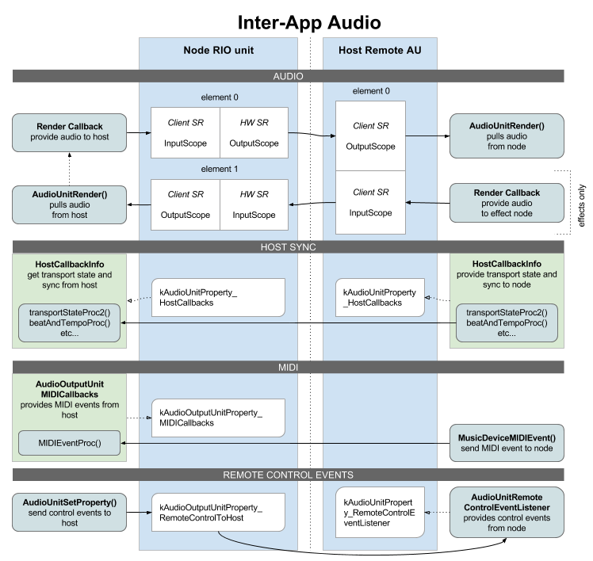

# Overview

Inter-App Audio on iOS is a technology to stream audio between apps, or more specifically between a host app and one or more node apps.

Apart from streaming audio, IAA also provides mechanisms for synchronization, MIDI, and remote control events.

Each host app can host any number of nodes, and each node app can have multiple node ports. A host app can also be a node app, hosted in another host.



# Implementing a node app

To be a node, you use a RemoteIO unit just like you normally do. While connected to a host, your render callback will instead provide audio to the host. For effect nodes, your call to `AudioUnitRender()` will pull audio from the host instead of the hardware audio input.

## Publish yourself

To make yourself available as an IAA node, you fill out the `AudioComponents` array in your Info.plist. Then you publish your RemoteIO unit using `AudioOutputUnitPublish()`, unless you're using the Audiobus SDK which will then publish the unit for you.

A single IAA app can have multiple node ports. There are four kinds of ports:

- kAudioUnitType_RemoteGenerator
- kAudioUnitType_RemoteInstrument
- kAudioUnitType_RemoteEffect
- kAudioUnitType_RemoteMusicEffect

The only difference is that Instrument and MusicEffect supports IAA MIDI.

## Host sync

The host can implement host callbacks, that can then be retrieved and called by the node, letting the host provide current transport state and precise timing information for synchronization purposes. Use this to let your node app follow the host with perfect timing. See [iOS Audio Sync](/ios_audio_sync.html) for all the details.

You also use the host callbacks to display the hosts transport state and time location if you implement a Host Transport Panel UI in your node app.

## IAA-MIDI

An Inter-App Audio node app can receive direct MIDI from the host, without going through CoreMIDI. The host can then schedule MIDI events to the node with sample-accurate precision, using `MusicDeviceMIDIEvent()`. Also routing becomes easier, there's no need to find the correct virtual endpoints to connect - especially if the host is the producer of the events (a sequencer).

To receive MIDI events this way, the node must be of type "instrument" or "music effect".

First define a MIDI callback. The callback will be called from the realtime rendering thread (com.apple.coreaudio.auserver.io), before each render cycle, to provide you with any incoming MIDI messages from the host.

```objc
void MIDIEventProcCallBack(
    void *userData,
    UInt32 inStatus,
    UInt32 inData1,
    UInt32 inData2,
    UInt32 inOffsetSampleFrame) {
    __unsafe_unretained id self = (id)userData;
    // handle your event here, probably by
    // putting it on a simple FIFO or similar
    // for pending events to be rendered 
    // in your render callback.
}
```

Then attach your callback to your hosted RIO unit:

```objc
AudioOutputUnitMIDICallbacks cb = {0,};
cb.userData = self;
cb.MIDIEventProc = MIDIEventProcCallBack;

AudioUnitSetProperty (outputUnit,
    kAudioOutputUnitProperty_MIDICallbacks,
    kAudioUnitScope_Global, 0,
    &cb, sizeof(cb));
```

Using the `inOffsetSampleFrame` is essential to get a jitter-free and precise response to MIDI events. The events are received in the same order as they are sent by the host, there's no internal scheduling or sorting being done by the system. Therefore, there's no *guarantee* that `inOffsetSampleFrame` will be within bounds of the buffer (though one should expect hosts to keep it within bounds) or that they will be in incrementing order.

Note that since your MIDI callback is called on the audio render thread, it's very important that you treat it with the same caution as your render callback: No blocking operations, no memory allocations, no locks, no objective-C or Swift code.

## Remote control events

A node can send remote control events to the host. There are pre-defined events for toggle-play, rewind and record.

```objc
// Send an event to toggle play/pause
UInt32 ev = kAudioUnitRemoteControlEvent_TogglePlayPause;
UInt32 sz = sizeof(ev);
AudioUnitSetProperty(_outputUnit, 
    kAudioOutputUnitProperty_RemoteControlToHost, 
    kAudioUnitScope_Global, 0,
    &ev, sz);
```

This is used to implement a host transport panel. My app [AUM](http://kymatica.com/aum) also abuses these events to get latency reports from hosted IAA nodes such as my [AUFX apps](http://kymatica.com/aufx), by encoding the latency in the higher bits and a special `0xff` event in the lower bits. See [IAA latency compensation](/iaa_latency_comp.html) for full details.

## Switch to host app

To display a button that switches back to the host, you need the icon to display on the button:

```objc
UIImage *hostIcon = AudioOutputUnitGetHostIcon(_outputUnit, 152);
```

To switch to the host app, you get the hosts peer URL and then open it:

```objc
CFURLRef url;
UInt32 size = sizeof(url);
OSStatus result = AudioUnitGetProperty(_outputUnit, 
    kAudioUnitProperty_PeerURL,
    kAudioUnitScope_Global, 0,
    &url, &size);
if (result == noErr) {
    [[UIApplication sharedApplication] openURL:(__bridge NSURL*)url];
}
```

Instead of just opening the host, you can display an [IAA Node Panel](/iaa_node_panel.html) that allows you to switch not only to the host, but to any other sibling node app that are also hosted in the same host, as can be seen in my [AUFX apps](http://kymatica.com/aufx).

## Some important details

One important aspect to handle correctly are sample rate changes and conversion between the hardware audio session, the host, and the node. See [IAA and sample rates](/iaa_sample_rates.html) for more about that.

There's a few quirks and iOS bugs you should be aware of, regarding using multiple IAA ports, and avoiding "IAA zombies". Read more about that here: [IAA quirks](/iaa_quirks.html)  

